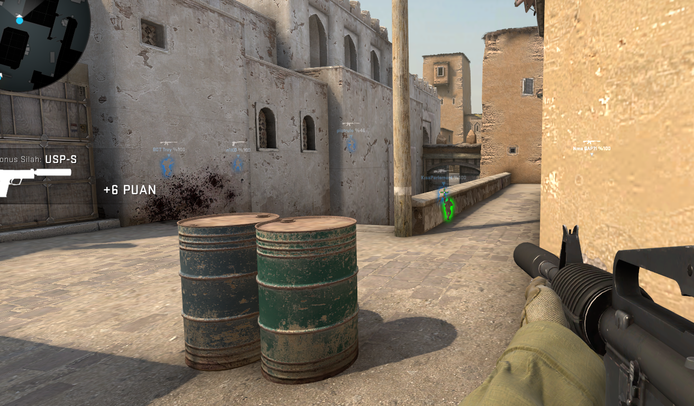

## CS GO SIMPLE GLOW

-- This is a simple glow script which developed on c#.

-    [For update offsets](https://github.com/frk1/hazedumper)

# You must update this offsets

		public class Offsets
        {
            public static int lp = 0xDEA964; //dwLocalPlayer
            public static int myt = 0xF4;  //m_iTeamNum
            public static int entt = 0x4DFFF14; //dwEntityList
            public static int drmnt = 0xED;  //m_bDormant
            public static int gin = 0x10488;  //m_iGlowIndex
            public static int gob = 0x535A9D8;  //dwGlowObjectManager
            public static int hlt = 0x100;  //m_iHealth
            public static int pli = 0x180; //dwClientState_GetLocalPlayer
        }

## ScreenShot

